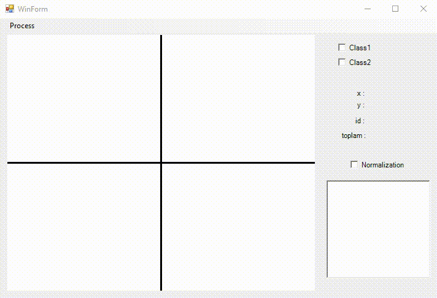
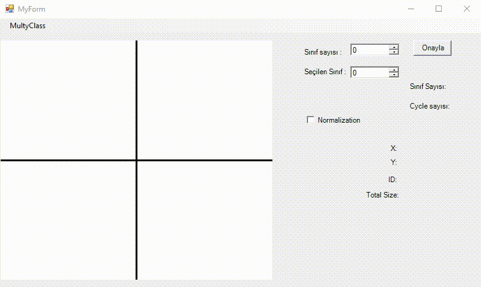

## Artificial Neural Network
Classifications have been made in different categories.
### - Single Category Single Layer Neural Network
    - discrete (Perceptron Learning Rule)
    - continuos (Delta Learning Rule)
    
DISCRETE                   |  CONTINOUS
:-------------------------:|:-------------------------:
          |  
    
    
### -Multi Category Single Layer Neural Network 
    - Discrete (Perceptron Learning Rule) 
    - Continous (Delta Learning Rule)
    
DISCRETE                   |  CONTINOUS
:-------------------------:|:-------------------------:
          |  

### Multi Layer Neural Network
    - Error Back Propagation
    
 

